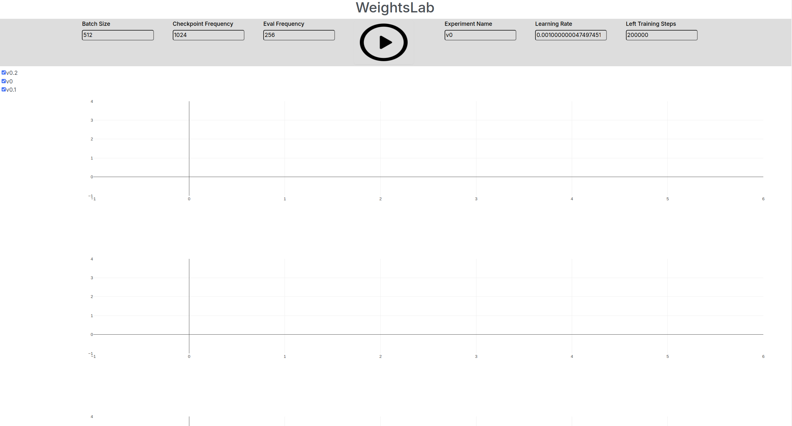

# WeightsLab UI onboarding steps
This is WeightsLab (or Graybox UI) an UI interface designed to allow AI
practitioners to have better control over the training process of
Deep Neural Networks training.

This a is early prototype of a solution that aims to DEBUG and FIX potential
problems that occurs during training:
* overfitting
* plauteous
* minority class misses
* problematic data samples analysis
* data set slicing
* weights manipulation (freezing, reinitalization)

Since the paradigm is about granular statistics and interactivity, this allows
for very useful and intersting flows to be performed:
* model minimization
* data set curation
* root cause analysis
* reduction in non-determinism


## Downlopad the graybox framework (that supports interactive operations on data and weights)
git clone git@github.com:rotalex/graybox.git
## Install the package locally
pip instal -e .

## Download the UI package locally and compile the rpc messages
python -m grpc_tools.protoc -I. --python_out=. --grpc_python_out=. experiment_service.proto


## Define the experiment objects (model, dataset, etc)

Create a experiment file with all the necessary objects bundled into an 
Experiment object.

```
class SimpleConvNet(NetworkWithOps):
    def __init__(self):
        super(SimpleConvNet, self).__init__()
        self.tracking_mode = TrackingMode.DISABLED

        self.layer1 = Conv2dWithNeuronOps(
            in_channels=3, out_channels=8, kernel_size=3, padding=1)
        self.bnorm1 = BatchNorm2dWithNeuronOps(8)
        self.mpool1 = nn.MaxPool2d(kernel_size=2, stride=2)

        self.fc1 = LinearWithNeuronOps(in_features=8*5*5, out_features=10)
        self.drop1 = nn.Dropout(0.25)

        self.fc3 = LinearWithNeuronOps(in_features=10, out_features=200)
        self.softmax = nn.Softmax(dim=1)

    # Define dependencies between layer, such that adjusting the input sizes
    # is done automatically.
    def define_deps(self):
        self.register_dependencies([
            (self.layer1, self.bnorm1, DepType.SAME),
            (self.bnorm1, self.layer2, DepType.INCOMING),
            ...

            (self.fc1, self.fc2, DepType.INCOMING),
            (self.fc2, self.fc3, DepType.INCOMING),
        ])
        self.flatten_conv_id = self.bnorm5.get_module_id()

    def forward(self, x, intermediary: Dict[int, th.Tensor] | None = None):
        self.maybe_update_age(x)
        x = self.layer1(x, intermediary=intermediary)
        x = self.bnorm1(x)
        x = F.relu(x)
        x = self.mpool1(x)
        ....

        x = x.view(x.size(0), -1)
        x = self.fc1(x, intermediary=intermediary)
        x = F.relu(x)

        # For the last layer we skip the regular statistics updates
        output = self.fc3(x, skip_register=True, intermediary=None)
        one_hot = F.one_hot(
            output.argmax(dim=1), num_classes=self.fc3.out_features)

        if hasattr(x, 'in_id_batch') and hasattr(x, 'label_batch'):
            add_tracked_attrs_to_input_tensor(
                one_hot, in_id_batch=input.in_id_batch,
                label_batch=input.label_batch)
        self.fc3.register(one_hot)


        output = self.softmax(output)
        return output


data_dir = "tiny-224/"
# Normalized & Flipped Dataset
data_transforms = {
    "train": T.Compose(
        [
            T.RandomHorizontalFlip(0.5),
            T.ToTensor(),
            T.Normalize([0.4802, 0.4481, 0.3975], [0.2302, 0.2265, 0.2262]),
        ]
    ),
    "val": T.Compose(
        [
            T.ToTensor(),
            T.Normalize([0.4802, 0.4481, 0.3975], [0.2302, 0.2265, 0.2262]),
        ]
    ),
    "test": T.Compose(
        [
            T.ToTensor(),
            T.Normalize([0.4802, 0.4481, 0.3975], [0.2302, 0.2265, 0.2262]),
        ]
    ),
}
image_datasets = {
    x: ds.ImageFolder(os.path.join(data_dir, x), data_transforms[x]) for x in ["train", "val", "test"]
}

device = th.device("cuda:0")


def get_exp():
    model = SimpleConvNet()
    model.define_deps()

    exp = Experiment(
        model=model, optimizer_class=optim.Adam,
        train_dataset=image_datasets["train"],
        eval_dataset=image_datasets["val"],
        device=device, learning_rate=1e-3, batch_size=512,
        training_steps_to_do=200000,
        name="v0",
        root_log_dir='tiny-image-net', # Folderst to store technical data and checkpoints
        logger=Dash("tiny-image-net"),
        skip_loading=False)

    def stateful_difference_monitor_callback():
        exp.display_stats()

    return exp

```


## Connect the experiment file to the backend:
```
#graybox_backend.py :

from experiment_definition_file import get_exp

experiment = get_exp()

```


## Launch the experiment training process:
python graybox_backend.py


## Launch the experiment monitoring and controlling UI process
python weights_lab.py --root_directory=PATH_TO_ROOT_DIRECTORY_OF_EXPERIMENT

## Open the link in browser
```
....
Dash is running on http://127.0.0.1:8050/
....
```

### Initial page


### Short Demos


